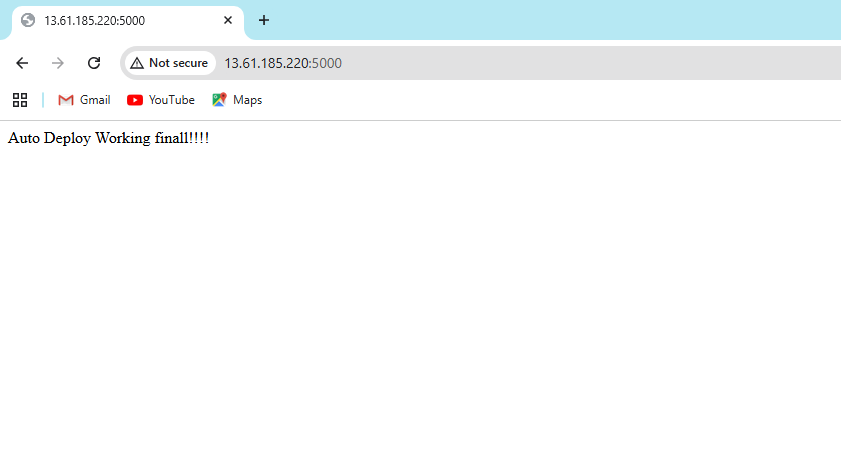
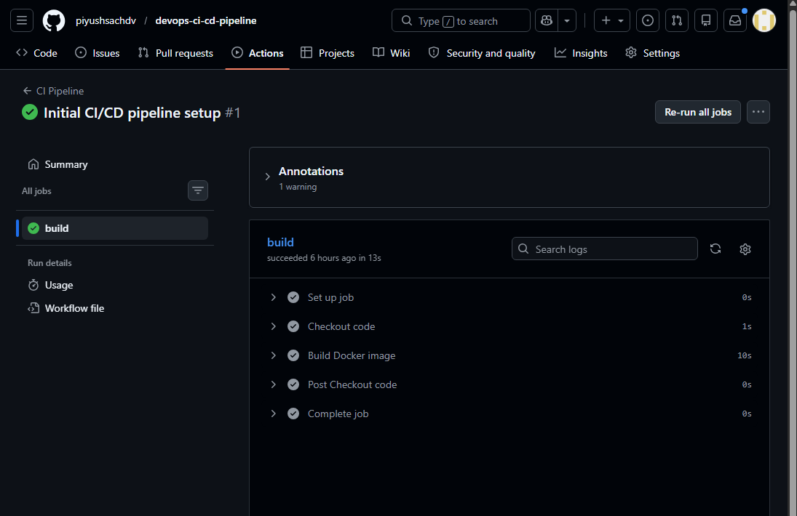
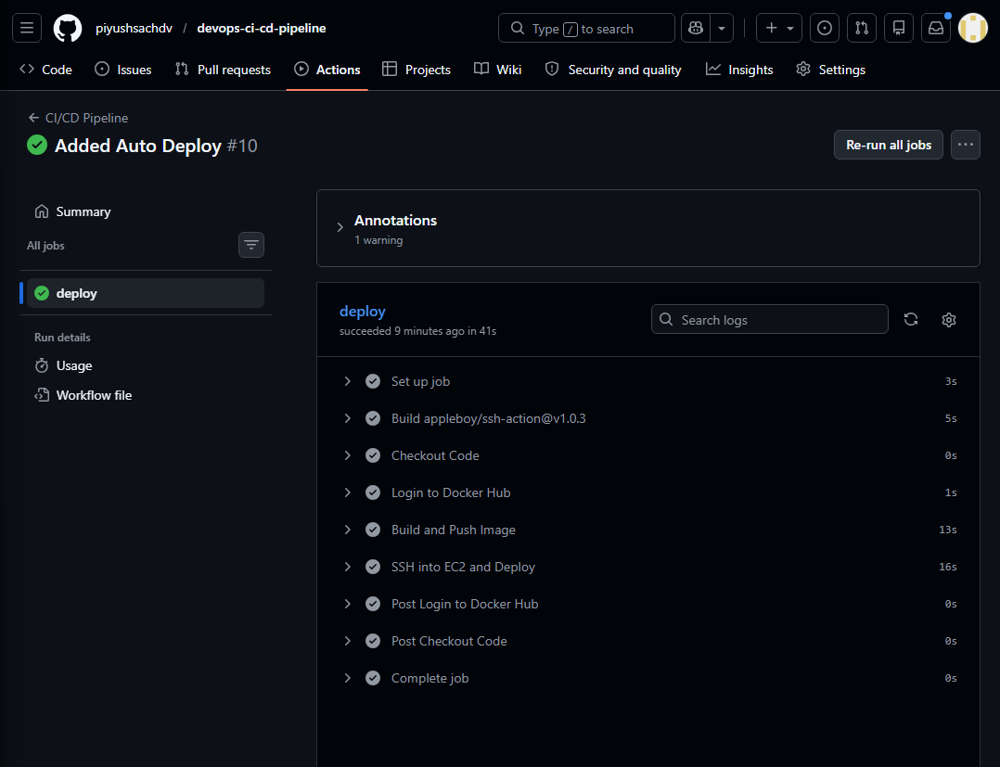
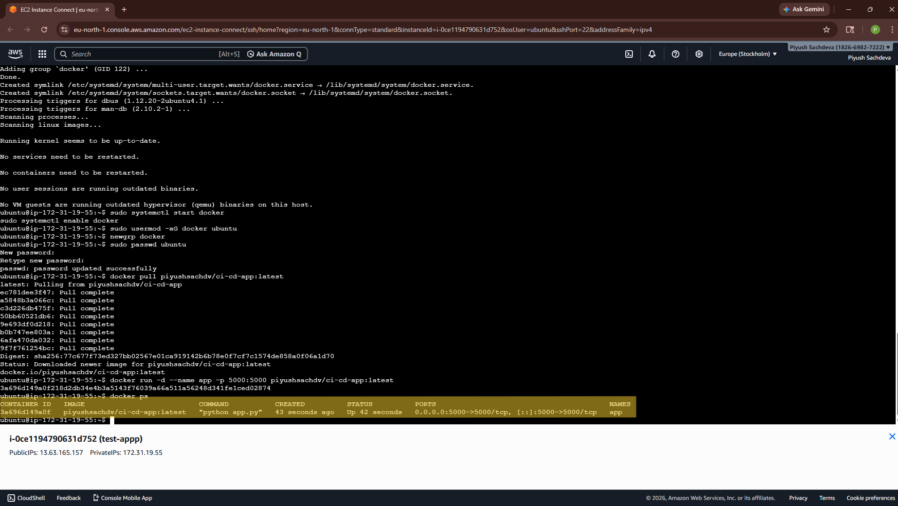
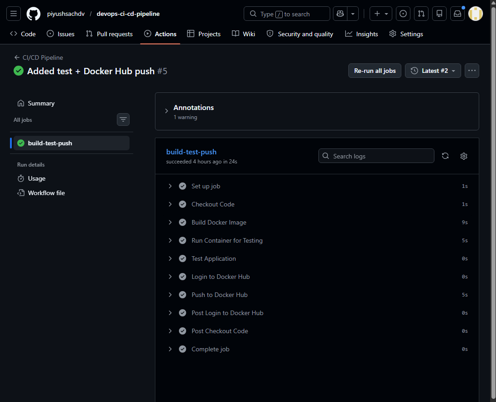

# DevOps CI/CD Pipeline with Automated Deployment

## Overview
This project demonstrates a complete end-to-end CI/CD pipeline using GitHub Actions, Docker, and AWS EC2 with fully automated deployment. The pipeline builds, tests, and deploys a containerized application automatically whenever code is pushed to the repository.

---

## Architecture
GitHub → GitHub Actions → Docker Hub → AWS EC2 → Live Application

---

## Tech Stack
- Docker (Containerization)
- GitHub Actions (CI/CD Automation)
- AWS EC2 (Cloud Deployment)
- Python Flask (Application)
- Linux (Ubuntu)

---

## CI/CD Workflow
1. Code is pushed to GitHub repository  
2. GitHub Actions pipeline is triggered  
3. Docker image is built from the application  
4. Image is pushed to Docker Hub  
5. Pipeline connects to AWS EC2 via SSH  
6. Latest image is pulled on EC2  
7. Existing container is stopped and replaced  
8. Updated application is deployed automatically  

---

## Proof of Deployment

### Application Running on AWS EC2
The application is deployed on an EC2 instance and accessible via public IP.

---

### CI/CD Pipeline Success
GitHub Actions successfully runs the pipeline on every push.

---

### Workflow Execution
Pipeline stages including build, test, push, and deployment.

---

### EC2 Deployment Verification
Docker container running on EC2 instance.

---

### Docker Hub Image
Docker image stored and versioned on Docker Hub.

---

## Local Setup

To run the project locally:

docker build -t ci-cd-app .
docker run -p 5000:5000 ci-cd-app

Access in browser:
http://localhost:5000

---

## Security Practices
- Used GitHub Secrets for secure credential management  
- SSH-based authentication for deployment  
- No sensitive data stored in code  

---

## Key Highlights
- Fully automated CI/CD pipeline  
- Real-time deployment on AWS EC2  
- Docker-based containerized application  
- Zero manual intervention after setup  

---

## Future Improvements
- Add domain and HTTPS using Nginx  
- Integrate monitoring tools (Prometheus, Grafana)  
- Automate infrastructure using Terraform  
- Implement rollback strategy for failures  

---

## Author
Piyush Sachdeva  
Cloud & DevOps Engineer
